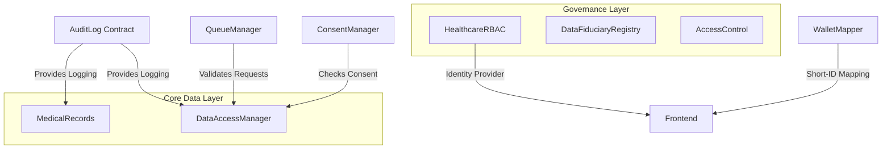

# Aegis Care: Decentralized Healthcare Ecosystem

[](https://algorand.com/)
[](https://opensource.org/licenses/MIT)
[](https://github.com/algorandfoundation/algokit-cli)

**Aegis Care** is a next-generation, privacy-preserving healthcare data management platform. It leverages the Algorand blockchain for immutable auditing and role-based access control (RBAC), combined with IPFS for secure, decentralized storage of encrypted medical records.

---

## 🏛 Architecture & System Design

Aegis Care uses a modular "micro-contract" architecture. Each contract handles a specific domain of the healthcare lifecycle, ensuring separation of concerns and upgradeability.

### Contract Dependency & Bootstrap Flow
The system requires a specific deployment and "bootstrapping" sequence to link contracts together:



### Technical Stack
*   **Blockchain:** Algorand Layer 1 (TEAL / Puya Python)
*   **Storage:** IPFS (via Pinata) with AES-256-GCM client-side encryption
*   **Frontend:** React 18, Vite, TypeScript, Tailwind CSS
*   **Communication:** ARC-56 (App Spec) and ARC-28 (Events)

---

## 🚀 Getting Started

### Prerequisites
*   [AlgoKit CLI](https://github.com/algorandfoundation/algokit-cli)
*   Docker Desktop (for LocalNet)
*   Node.js 20+ & Python 3.12+
*   [Pinata API Key](https://app.pinata.cloud/) (for IPFS uploads)

### Installation & Deployment
1.  **Clone & Bootstrap:**
    ```bash
    git clone https://github.com/your-repo/aegis-care.git
    cd Aegis-Care
    algokit project bootstrap all
    ```
2.  **Start LocalNet:**
    ```bash
    algokit localnet start
    ```
3.  **Build & Deploy Contracts:**
    ```bash
    cd projects/aegis-contracts
    algokit project run build
    algokit project deploy localnet
    ```
    *Note: The deployment script `deploy_all.ts` automatically updates the frontend's `.env` with new App IDs.*

4.  **Configure IPFS:**
    Follow the [Pinata Setup Guide](./PINATA_SETUP.md) to add your JWT to `projects/aegis-frontend/.env.local`.

### Environment Variable Schema

| Variable | Scope | Description |
| :--- | :--- | :--- |
| `VITE_ALGOD_NETWORK` | Frontend | Target network (localnet, testnet, mainnet). |
| `VITE_*_APP_ID` | Frontend | Application IDs for the 9 core contracts (Auto-generated). |
| `NEXT_PUBLIC_PINATA_JWT` | Frontend | API JWT for Pinata IPFS integration. |
| `DEPLOYER_MNEMONIC` | Contracts | Secret mnemonic for the deployment account. |
| `INDEXER_SERVER` | Global | URL for the Algorand Indexer. |

5.  **Run Frontend:**
    ```bash
    cd projects/aegis-frontend
    npm run dev
    ```

---

## 🛠 API & Data Structures

### Medical Record Structure (ARC-4)
Records are stored on-chain as packed structs within Algorand Boxes:
```python
class Record(arc4.Struct):
    id: arc4.UInt64
    patient: arc4.Address
    provider: arc4.Address
    cid: arc4.String          # IPFS Content Identifier
    previous_cid: arc4.String   # For versioning/audit trail
    record_type: arc4.String    # e.g., "Prescription", "LabReport"
    timestamp: arc4.UInt64
    bill_amount: arc4.UInt64
```

### Key Contract Methods
| Contract | Method | Purpose |
| :--- | :--- | :--- |
| `MedicalRecords` | `add_record` | Anchors an encrypted IPFS CID to a patient's address. |
| `QueueManager` | `submit_request` | Initiates a data access or emergency request. |
| `HealthcareRBAC` | `register_role` | Assigns bitmask-based roles (Hospital=1, Doctor=2, etc.). |
| `AuditLog` | `log_data_accessed`| (Internal) Records an immutable entry for every access event. |

---

## 🔐 Security & Compliance

### Client-Side "Zero-Knowledge"
Aegis Care ensures that plaintext medical data never touches the blockchain.
1.  **Encryption:** Files are encrypted using AES-256-GCM in the user's browser.
2.  **Storage:** Only the encrypted blob is sent to IPFS.
3.  **Decryption:** Only authorized fiduciaries (Doctors/Labs) with the correct decryption keys (exchanged out-of-band or via secure protocol) can view the data.

### Production Readiness Checklist
- [ ] **Rotate Admin:** Update `FIXED_ADMIN` in `deploy_all.ts` to a Multi-Sig wallet.
- [ ] **Audit Contracts:** Perform a formal TEAL/Puya security audit.
- [ ] **Box MBR Management:** Ensure all contracts are funded to cover Minimum Balance Requirements (MBR) for Box storage.
- [ ] **Key Management:** Integrate a secure Key Management System (KMS) for patient encryption keys.

---

## 📊 Scalability & Performance
*   **Box Storage:** Uses Algorand's Box storage for $O(1)$ access to patient records.
*   **Indexing:** The Auditor portal leverages ARC-28 events, which are indexed off-chain for high-performance searching without hitting the blockchain nodes directly.
*   **Batching:** Prescription dispensing utilizes a queue system to minimize transaction overhead.

---

## 🤝 Contributing

We welcome contributions! Please follow the standard workflow:
1.  **Modify:** Update smart contracts in `projects/aegis-contracts/smart_contracts`.
2.  **Build:** Run `algokit project run build` to update TEAL and ARC-56 specs.
3.  **Client Gen:** The frontend automatically picks up changes via the generated TypeScript clients.
4.  **Test:** Run `pytest` in the contracts directory to validate logic changes.

---

## 📄 License
This project is licensed under the MIT License - see the [LICENSE](LICENSE) file for details.
