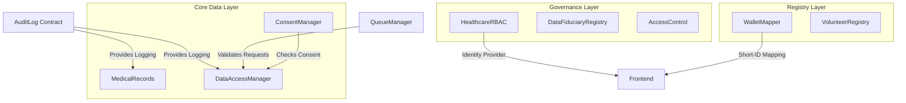

# Aegis Care: Decentralized Healthcare Ecosystem

[](https://algorand.com/)
[](https://github.com/your-repo/aegis-care)
[](https://opensource.org/licenses/MIT)
[](https://github.com/algorandfoundation/algokit-cli)

**Aegis Care** is a privacy-preserving healthcare data management platform built on the Algorand blockchain for immutable auditing and role-based access control (RBAC), combined with IPFS for decentralized storage of encrypted medical records.

> **Status: Prototype / v1.0.** Contracts are deployed to testnet. The automated test suite and some integrations are not yet complete — see [Known Limitations](#known-limitations).

---

## Architecture & System Design

Aegis Care uses a modular "micro-contract" architecture. Each contract handles a specific domain of the healthcare lifecycle, ensuring separation of concerns.

### Contract Dependency & Bootstrap Flow
The system requires a specific deployment and bootstrapping sequence to link contracts together:



### Technical Stack
*   **Blockchain:** Algorand Layer 1 (TEAL / Puya Python)
*   **Storage:** IPFS (via Pinata) with AES-256-GCM client-side encryption
*   **Frontend:** React 18, Vite, TypeScript, Tailwind CSS
*   **Communication:** ARC-56 (App Spec) and ARC-28 (Events)

---

## Getting Started

### Prerequisites
*   [AlgoKit CLI](https://github.com/algorandfoundation/algokit-cli)
*   Docker Desktop (for LocalNet)
*   Node.js 20+ & Python 3.12+
*   [Pinata API Key](https://app.pinata.cloud/) (for IPFS uploads)

### Installation & Deployment

1.  **Clone & Bootstrap:**
    ```bash
    git clone https://github.com/gtathelegend/Aegis-Care.git
    cd Aegis-Care
    algokit project bootstrap all
    ```

2.  **Start LocalNet:**
    ```bash
    algokit localnet start
    ```

3.  **Build & Deploy Contracts:**
    ```bash
    cd projects/aegis-contracts
    algokit project run build
    npx ts-node scripts/deploy_all.ts
    ```
    `scripts/deploy_all.ts` deploys all 10 contracts, runs the bootstrap linking between them, and writes the generated App IDs directly into `projects/aegis-frontend/.env`.

    > **Admin wallet requirement:** `deploy_all.ts` enforces a `FIXED_ADMIN` check — the deployer account must match the address hardcoded in `scripts/deploy_all.ts`. Set `DEPLOYER_MNEMONIC` in your environment accordingly, or update `FIXED_ADMIN` in that file to your own wallet before deploying to a new environment.

4.  **Configure IPFS:**
    Follow the [Pinata Setup Guide](./PINATA_SETUP.md) to add your JWT to `projects/aegis-frontend/.env.local`.

### Environment Variable Schema

| Variable | Scope | Description |
| :--- | :--- | :--- |
| `VITE_ALGOD_NETWORK` | Frontend | Target network (`localnet`, `testnet`, `mainnet`). |
| `VITE_ALGOD_SERVER` | Frontend | Algod node URL. |
| `VITE_ALGOD_PORT` | Frontend | Algod port (4001 for LocalNet). |
| `VITE_INDEXER_SERVER` | Frontend | Algorand Indexer URL. |
| `VITE_INDEXER_PORT` | Frontend | Indexer port (8980 for LocalNet). |
| `VITE_KMD_SERVER` | Frontend | KMD server URL (LocalNet only). |
| `VITE_KMD_WALLET` | Frontend | KMD wallet name (LocalNet only). |
| `VITE_*_APP_ID` | Frontend | App IDs for the 10 core contracts. Written automatically by `scripts/deploy_all.ts`. |
| `VITE_PINATA_JWT` | Frontend | Pinata API JWT for IPFS uploads. |
| `DEPLOYER_MNEMONIC` | Contracts | Mnemonic for the deployment account. Must match `FIXED_ADMIN` in `scripts/deploy_all.ts`. |

5.  **Run Frontend:**
    ```bash
    cd projects/aegis-frontend
    npm run dev
    ```

---

## API & Data Structures

### Medical Record Structure (ARC-4)
Records are stored on-chain as packed structs within Algorand Boxes:
```python
class Record(arc4.Struct):
    id: arc4.UInt64
    patient: arc4.Address
    provider: arc4.Address
    cid: arc4.String          # IPFS Content Identifier
    previous_cid: arc4.String # For versioning/audit trail
    record_type: arc4.String  # e.g., "Prescription", "LabReport"
    timestamp: arc4.UInt64
    bill_amount: arc4.UInt64
```

### Key Contract Methods
| Contract | Method | Purpose |
| :--- | :--- | :--- |
| `MedicalRecords` | `add_record` | Anchors an encrypted IPFS CID to a patient's address. |
| `QueueManager` | `submit_request` | Initiates a data access or emergency request. |
| `HealthcareRBAC` | `register_role` | Assigns bitmask-based roles (combinable via OR): Hospital (bit 0)=1, Doctor (bit 1)=2, Lab (bit 2)=4, Pharmacy (bit 3)=8, Insurance (bit 4)=16, Auditor (bit 5)=32. |
| `AuditLog` | `log_data_accessed` | (Internal) Records an immutable entry for every access event. |

---

## Security & Compliance

### Client-Side Encryption

Aegis Care ensures that plaintext medical data never touches the blockchain.

1.  **Encryption:** Files are encrypted using AES-256-GCM in the user's browser before upload.
2.  **Storage:** Only the encrypted blob is sent to IPFS; the on-chain record stores only the resulting CID.
3.  **Decryption:** Only authorized fiduciaries (Doctors/Labs) with the correct decryption keys — exchanged out-of-band or via a secure key management protocol — can view the data.

### Production Readiness Checklist

- [ ] **Rotate Admin:** Replace `FIXED_ADMIN` in `scripts/deploy_all.ts` with a Multi-Sig wallet address.
- [ ] **Audit Contracts:** Perform a formal TEAL/Puya security audit before mainnet deployment.
- [ ] **Box MBR Management:** Ensure all contracts are funded to cover Minimum Balance Requirements (MBR) for Box storage.
- [ ] **Key Management:** Integrate a secure Key Management System (KMS) for patient encryption keys.
- [ ] **Test Suite:** Write and pass contract tests before any production deployment (none currently exist).

---

## Scalability & Performance

*   **Box Storage:** Uses Algorand Box storage for O(1) key-based lookup of a patient's record set. Note that iterating within a patient's record array (e.g., during prescription dispensing) is O(n) in record count.
*   **Indexing:** The Auditor portal leverages ARC-28 events, indexed off-chain for high-performance querying without hitting blockchain nodes directly.
*   **Prescription Queue:** A queue structure tracks dispensing state across providers. This is a workflow management pattern, not a transaction batching mechanism.

---

## Known Limitations

*   **No on-chain consent enforcement on all paths:** `DataAccessManager` is linked to `ConsentManager` but consent validation is not yet enforced across every access path.
*   **O(n) prescription queue iteration:** `mark_prescription_dispensed` must scan the full patient record array to update bill amounts.
*   **No emergency access expiry:** Approved emergency requests in `QueueManager` do not automatically expire.
*   **Volunteer registry hash collisions:** The 32-byte hash ID mitigates but does not fully eliminate collision risk.
*   **No automated test suite:** Contract logic has no `pytest` tests yet; all validation is currently manual.
*   **`AccessControl` not deployed by `deploy_all.ts`:** The factory is imported in the deployment script but the contract is not deployed. It requires a separate deployment step if used.

---

## Contributing

Contributions are welcome. Please follow this workflow:

1.  **Modify:** Update smart contracts in `projects/aegis-contracts/smart_contracts`.
2.  **Build:** Run `algokit project run build` to regenerate TEAL and ARC-56 specs.
3.  **Client Gen:** The frontend picks up changes via the generated TypeScript clients in `src/contracts/`.
4.  **Deploy:** Run `npx ts-node scripts/deploy_all.ts` from `projects/aegis-contracts` to deploy updated contracts to LocalNet.
5.  **Test:** There is no automated test suite yet. Adding `pytest` tests in the contracts directory as part of your contribution is encouraged.

---

## License

This project is licensed under the MIT License.
